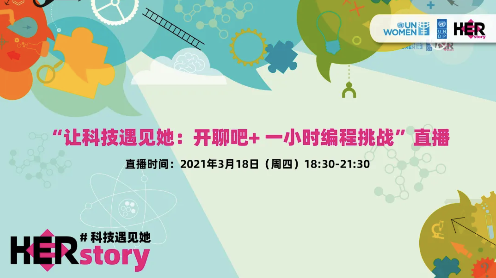
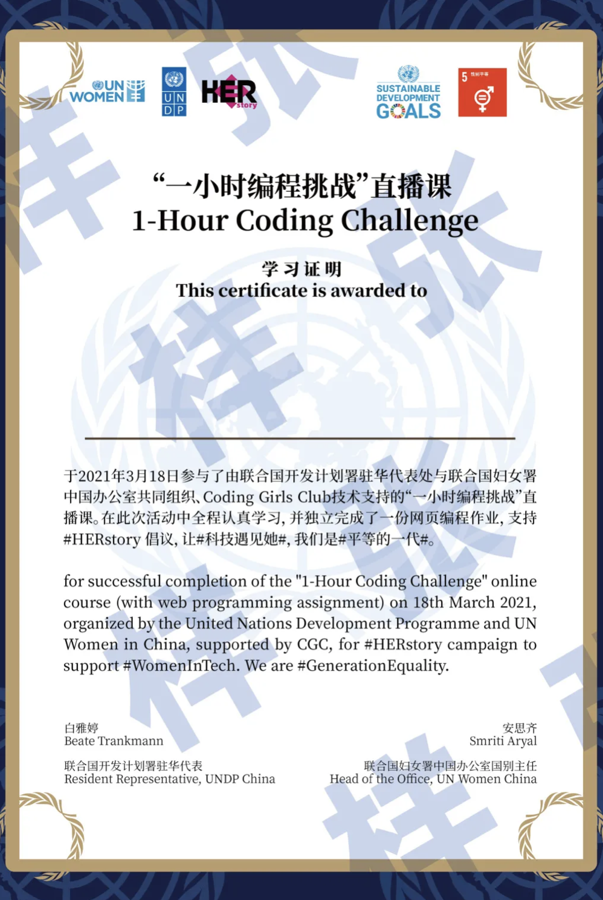

# 科技遇见她
## 分享你与科技的#HERstory
### 一小时编程挑战直播课
#### 等你来挑战

联合国开发计划署
联合国妇女署
Coding Girls Club

> 在联合国#平等的一代#倡导活动的框架之下，联合国开发计划署（UNDP）与联合国妇女署（UN Women）共同发起#HERstory# #科技遇见她#倡议活动，聚焦科技领域、开启故事征集，将许许多多个体的故事汇流成川，为广大有志进入科技领域的女性赋予信心。

在自建的网页中，在自建网页中，以图文或短视频的形式，选择以下角度展示你的#科技遇见她 #HERstory 😉

* 你自己突破性别固有印象、在科技相关领域发展的故事
* 你受限于社会传统观念而无法追求自我梦想的故事，以及你内心的期待
* 你身边或者你了解到的某位科技界成功女性代表的故事

## 快来挑战叭 🥳

# 示例文章

_菌菌有话说：_
> Girls Coding Day这个活动从去年夏天到现在，在很多个城市成功的举办过很多场活动，得到过很多人的支持，也收到过很多学员温暖真切的回馈。很多学员和我们沟通过，这个活动给了她们走进编程世界的勇气和信心；也有已经当了妈妈的学员和我们分享过，这个活动给了她的生活添加了很多乐趣，以及带来了新的希望。其实作为组织者，一路走来，我们的感触并不比学员少。

  今天给大家分享一篇来自今年Girls  Coding Day武汉场负责人，人美心善的程序媛——刘司琪小姐姐在活动结束后写的一篇感想~  或许看完以后大家能发现，其实我们在坚持的，不只是举办这个活动本身，还有超过这个活动之外的，很多很多东西。

**文： 刘司琪**
**图 : Coding Girls Club**

2018年3月31日，武汉的第二期Girls Coding Day，也是我作为武汉GCD负责人组织的第一场活动。

去年的活动我还是个小教练，那时，我刚参加工作一年，而在那的一年前，我从未想过我会做这些跟科技与女性有关的事情。

 #### "大概是自己极少面对性别歧视有关的事情吧，或者身边有些事情，但那些属于大众默认的事情让自己也习以为常了，虽然在网上，这些事情层出不穷。"

直到参加工作之后，有些想法发生了变化。ThoughtWorks，作为一个最佳女性雇主的科技公司，一直都在宣传着招聘性别比例1：1，对女性的各种优待，需要说的是，当年招聘那会儿也是被这个吸引，在众多HR问你什么时候结婚，男朋友在哪里工作的时候，TW的HR问我的是如何看待女性程序员。我认同如此对女性的尊重，但我依然坚定着无标签论者，不喜欢将女性这个词放大化，仿佛一直在提醒着大家，女性就是弱势群体，这也是带着标签的歧视。现在想想，当时也是害怕被贴上女性的标签吧，宁愿不去看它，仿佛一直逃避着这件事情就不会存在。然而渐渐地明白问题不会因为视而不见而消失，只有人去不断的提出它，不断地提示着所有人，问题在那呢，才有可能发生改变，才有希望被解决，才不会因为所有人的漠视而让问题以大家以为这才是理所应当而消失，比如当年面试的时候，我只会和身边的女生讨论着告诉面试官我们几年之内不会结婚而提高面试通过的几率。而这些想法的改变的最初，是因为在TW新人培训中，和一个美国男生的讨论。

<iframe frameborder="0" src="https://v.qq.com/txp/iframe/player.html?vid=x0519dqfhwt" allowFullScreen="true"></iframe>

<iframe frameborder="0" src="https://v.qq.com/txp/iframe/player.html?vid=x0519dqfhwt" allowFullScreen="true"></iframe>

<iframe src="//player.bilibili.com/player.html?aid=288866567&bvid=BV1cf4y1C72K&cid=285335605&page=1" scrolling="no" border="0" frameborder="no" framespacing="0" allowfullscreen="true"> </iframe>
